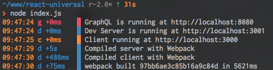

# react-universal

A `react` starter kit that handles universal rendering as well as a bunch of another neat things. This is sort of a living spec for how I build web applications.

## Already implemented

1. `babel`, because ES2015+ all the things.
2. `react`, clearly.
3. `react-router` for routing on the client and server.
4. `redux`, `react-redux`, `redux-devtools`, and `redux-thunk` for state management.
5. `koa` for the client server.
6. `express` for the `graphql` and dev server.
7. `graphql`, `graphql-relay` for building a backend.
8. `flow` type checking. I use `atom` with `nuclide`, but you can run flow by typing `flow` int he root of the repository.
9. `eslint` with the `airbnb` config plus some slight tweaks, like with flow, I'm linting using `atom` & `nuclide`, but you can simply run eslint (`./node_modules/.bin/eslint`) at the root of the repository

## Not yet implemented

1. `react-relay`, though the tools are included to get started with Relay, including the `graphql` backend, I've decided to not include the start of a Relay based front end until server-side rendering hooks are exposed [[Provide hooks for server-side rendering #136](https://github.com/facebook/relay/issues/136)].

2. A `database`, still deciding whether to push forward with Neo4j or use `Sequelize` + Postgres.

## Where'd the terminal ui go?

It felt pretty garish, and was very heavy, so I opted to remove it for a cleaner output.

